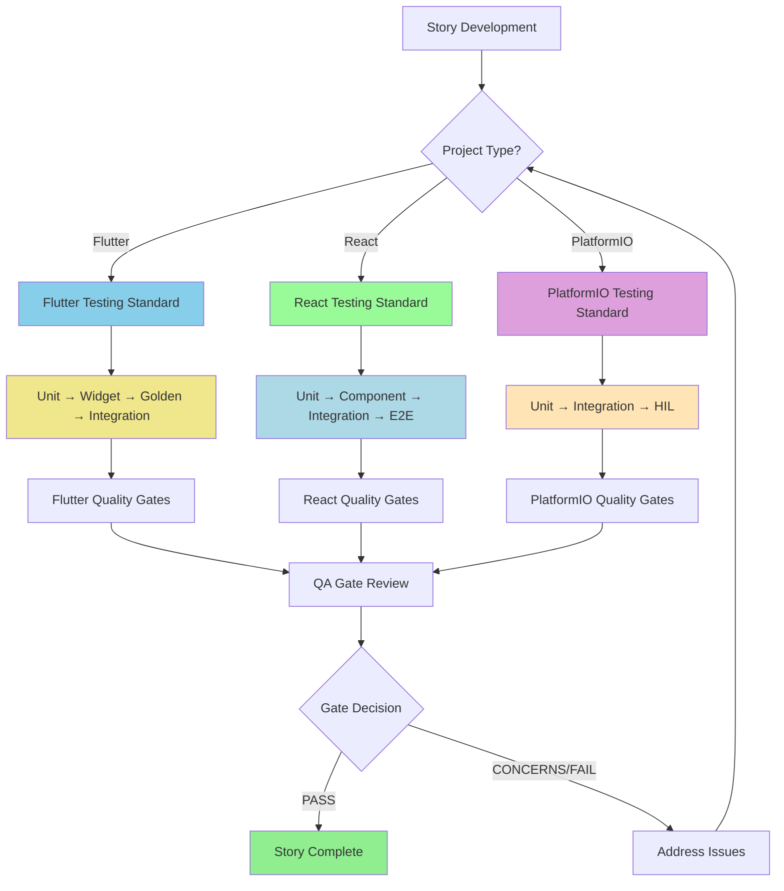

# Software Testing Official Organization-Wide Standards of Procedures
>
> **Note:** This document provides the organizational overview and directs teams to project-specific testing standards.

## Purpose

This document serves as the central hub for all testing standards within the organization, ensuring consistent quality and structured practices across different project types. It provides the framework that applies to all BMad-Core workflows while directing teams to project-specific testing standards.

## Project-Specific Testing Standards

### By Project Type

| Project Type | Testing Standard Document | Primary Frameworks |
|--------------|---------------------------|-------------------|
| **Flutter Applications** | [flutter-testing-standard.md](flutter-testing-standard.md) | `flutter_test` + `mocktail` |
| **React UI Applications** | [react-testing-standard.md](react-testing-standard.md) | `Jest` + `React Testing Library` |
| **PlatformIO Embedded** | [platformio-testing-standard.md](platformio-testing-standard.md) | `Unity Test Framework` |

> **Important:** Always refer to your project-specific testing standard for detailed implementation guidance. This document provides the organizational framework only.

---

## Universal Testing Strategy

### Three-Stage Foundation

All project types follow this foundational approach, adapted to their specific needs:

1. **Unit Testing**
   - **Focus**: Individual functions, modules, and components in isolation
   - **Coverage**: High coverage requirements (varies by project type)
   - **Mocking**: Permitted and encouraged for external dependencies
   - **Universal Principle**: Mocks are reserved for unit testing only

2. **Integration Testing**
   - **Focus**: System workflows and component interactions
   - **Coverage**: Critical paths and external integrations
   - **Mocking**: Generally prohibited (test real interactions)
   - **Project-Specific**: Implementation varies by technology stack

3. **End-to-End Testing**
   - **Focus**: Complete user workflows and business scenarios
   - **Coverage**: Primary user journeys and acceptance criteria
   - **Mocking**: Prohibited (test complete system)
   - **Validation**: Real environment testing required

### Project-Specific Adaptations

- **Flutter**: Unit → Widget → Golden → Integration testing
- **React**: Unit → Component → Integration → E2E testing
- **PlatformIO**: Unit → Integration → Hardware-in-the-Loop testing

---

## Standardized Make Targets

All projects must implement standardized make targets for consistent execution:

### Required Targets (Project-Specific Implementation)

```bash
# Unit Testing
make test-unit
# - Project-specific unit test execution
# - Coverage reporting and validation
# - Framework varies by project type

# Integration Testing
make test-integration
# - Component and system integration testing
# - External dependency validation
# - Real environment testing

# End-to-End Testing
make test-e2e
# - Complete workflow validation
# - User acceptance scenario testing
# - Production-like environment testing

# Complete Test Suite
make test
# - Executes all test stages in sequence
# - Primary target for CI/CD pipelines
# - Equivalent to: make test-unit && make test-integration && make test-e2e
```

### Implementation Requirements

* **Exit Codes**: All targets must return proper exit codes (0 = success, non-zero = failure)
* **Output Format**: Standardized reporting format for CI/CD integration
* **Coverage Integration**: Unit testing targets must include coverage reporting
* **Project-Specific**: Additional targets defined in project-specific standards

---

## Test Case Guidelines

* **Behavior Scenarios:** Each test scenario must map clearly to PRD requirements.
* **Edge Cases:** Must be included, covering hardware limits (where applicable), production issues, and stress/failure boundaries.
* **Automation:** Automate tests whenever possible; manual testing only if automation is impractical.
* **Risk-Based Prioritization:** Use `test-priorities-matrix.md` for P0/P1/P2/P3 classification.

---

## Execution & Reporting

1. **Test Plans:**
   Each project must include a structured test plan before implementation begins.
   * Use `test-design` task for automated test scenario generation.
   * Reference `test-levels-framework.md` for implementation guidance.

2. **Coverage Reporting:**
   Unit test coverage must be tracked and reported; Integration/Acceptance test pass rates must also be documented.

3. **Sign-Off Criteria:**

   * **Unit:** ≥90% coverage achieved.
   * **Acceptance:** All BDD scenarios pass and align with PRD.
   * **Integration:**

     * Hardware projects → HIL or Emulation testing completed and passed.
     * Software-only projects → E2E automation testing completed and passed.

4. **Reports:**
   Each release must include two standardized outputs:

   * `functionality-report.json` → Technical test results, coverage metrics, and PRD mapping.
   * `executive-report.json` → High-level summary of success rates, risks, and open issues for stakeholders.

5. **Defect Management:**

   * All failures logged in defect tracking system.
   * Root cause analysis required for repeat issues.
   * Use `risk-profile` task for systematic risk assessment.

---

## BMad-Core Integration

### Agent Workflow Integration

* **QA Agent**: Primary implementer of this standard through `*test-design`, `*trace`, and `*gate` commands
* **Dev Agent**: Must achieve 90% unit coverage before story completion
* **PM Agent**: Ensures acceptance criteria are BDD-testable during story creation

### Task Integration

* **test-design.md**: Automated test scenario generation following this standard
* **trace-requirements.md**: Maps acceptance tests to PRD requirements
* **qa-gate.md**: Validates compliance with this standard before story approval
* **review-story.md**: Comprehensive review including testing standard compliance

### Quality Gates

All stories must pass through QA gates that validate:\

* [ ] Unit tests achieve ≥90% coverage
* [ ] Acceptance tests map to PRD requirements using BDD format
* [ ] Integration tests cover all external system interactions
* [ ] Test reports generated in standardized format

---

## Quality Gates

### Universal Requirements

All stories must pass these quality gates regardless of project type:

- [ ] Unit tests achieve project-specific coverage requirements
- [ ] Integration tests validate external system interactions
- [ ] End-to-end tests cover critical user workflows
- [ ] Test reports generated in standardized format
- [ ] No prohibited mocking in integration/e2e tests

### Project-Specific Gates

Additional quality gates are defined in each project-specific testing standard:

- **Flutter**: Widget tests, golden tests, cross-platform validation
- **React**: Component tests, accessibility tests, browser compatibility
- **PlatformIO**: Hardware-in-the-loop tests, emulation validation

---

## Supplementary Resources

### Implementation Guidance

* **test-levels-framework.md**: Detailed decision criteria for test level selection
* **test-priorities-matrix.md**: Risk-based prioritization (P0/P1/P2/P3) system

### Automated Tooling

* **test-design task**: Systematic test scenario generation
* **trace-requirements task**: Automated requirement-to-test mapping
* **qa-gate task**: Quality gate decision automation

---

## Continuous Improvement

* Quarterly review of testing practices.
* Adoption of new automation/emulation tools as appropriate.
* Maintain alignment with industry standards (ISTQB, IEEE 829, ISO/IEC/IEEE 29119).
* Regular updates to supplementary guidance based on project learnings.

---

## Flow Diagram



---

## Implementation Guidance

### Choosing the Right Standard

1. **Identify Project Type**: Determine primary technology stack
2. **Select Testing Standard**: Use the appropriate project-specific document
3. **Follow Framework Requirements**: Implement required tools and patterns
4. **Validate Compliance**: Ensure quality gates are met

### Cross-Project Considerations

- **Monorepos**: May require multiple testing standards
- **Microservices**: Each service follows its appropriate standard
- **Full-Stack Projects**: Frontend and backend may use different standards

---

✅ **This organizational framework directs teams to project-specific testing standards. Always refer to your project-specific document for detailed implementation guidance.**
