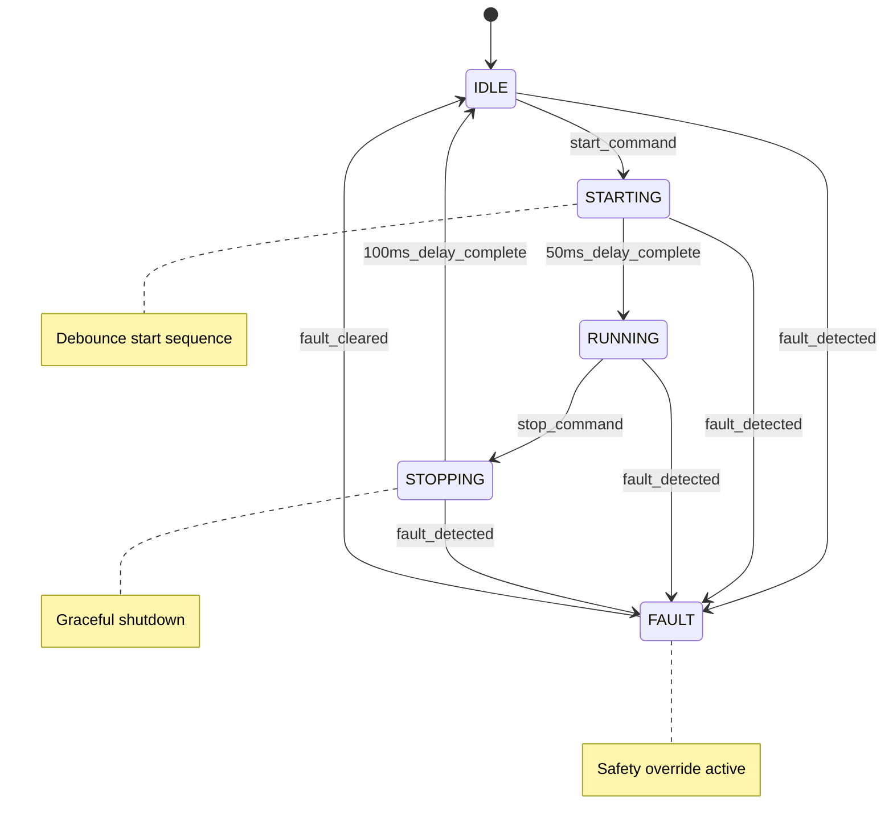

# Sonicator Control Design Document
**Project**: Multi-Sonicator I/O Controller  
**Epic**: Epic 1: Foundational Control & Communication  
**Story**: 1.4 Single Sonicator Control Implementation  
**Date**: 2025-09-12  
**Author**: Embedded Software Architect  
**Version**: 1.0.0  

## Overview

This document defines the design for single sonicator control implementation, completing Epic 1 by providing integrated control of Sonicator 4 via HAL abstractions and MODBUS register interface.

## Requirements Summary

### Functional Requirements (from Story 1.4)
1. Start/stop commands change output state reliably within expected timing
2. Amplitude setpoint accepted and applied within tolerance  
3. Telemetry registers report current state and fault/overload conditions
4. MODBUS RTU operations succeed within 100ms response time
5. HIL acceptance tests validate full control loop on hardware

### Safety Requirements (from Epic 1)
- Emergency stop response <50μs (per config.h)
- Watchdog timeout 1000ms monitoring
- Overload detection and failsafe activation
- Communication loss detection and safe state transition

## State Machine Design

### Core States



### State Transition Rules

| Current State | Event | Next State | Conditions | Timing |
|---------------|-------|------------|------------|---------|
| IDLE | start_command | STARTING | No active faults | Immediate |
| STARTING | delay_complete | RUNNING | 50ms elapsed, no faults | 50ms |
| RUNNING | stop_command | STOPPING | - | Immediate |
| STOPPING | delay_complete | IDLE | 100ms elapsed | 100ms |
| Any | fault_detected | FAULT | Overload/freq_unlock/timeout | Immediate |
| FAULT | fault_cleared | IDLE | Reset command + fault cleared | Immediate |

### Safety Transitions

**Emergency Stop**: Any state → FAULT (immediate, <50μs response)
**Watchdog**: No update() call >1000ms → FAULT
**Communication**: No MODBUS activity >2000ms → FAULT

## Hardware Interface Mapping

### Sonicator 4 Pin Assignments (config/hardware-config.yaml)

| Function | ATmega32A Pin | Physical Pin | HAL Interface | Direction |
|----------|---------------|--------------|---------------|-----------|
| START_4 | PC0 | 22 | gpio_write_pin() | Output |
| RESET_4 | PC1 | 23 | gpio_write_pin() | Output |
| OVERLOAD_4 | PD3 | 17 | gpio_read_pin() | Input |
| FREQ_LOCK_4 | PB4 | 5 | gpio_read_pin() | Input |
| FREQ_DIV10_4 | PB0 | 1 | timer_measure_frequency() | Input |
| POWER_SENSE_4 | PA7 | 33 | adc_read_channel() | Analog |
| AMPLITUDE_ALL | PD7 | 21 | pwm_set_duty_cycle() | PWM Output |

### Control Logic Implementation

#### Start Sequence (IDLE → STARTING → RUNNING)
```c
// 1. Validate preconditions
if (overload_active || !frequency_locked) {
    return false; // Cannot start
}

// 2. Set amplitude via shared PWM (PD7)
uint8_t pwm_value = (amplitude_percent - 20) * 255 / 80; // Scale 20-100% → 0-255
hal_pwm_set_duty_cycle(PWM_AMPLITUDE_CONTROL_PIN, pwm_value);

// 3. Assert START signal (PC0)
hal_gpio_write_pin(SON4_START_PIN, true);

// 4. Wait 50ms debounce period
// 5. Verify sonicator response via power/frequency telemetry
```

#### Stop Sequence (RUNNING → STOPPING → IDLE)  
```c
// 1. De-assert START signal (PC0)
hal_gpio_write_pin(SON4_START_PIN, false);

// 2. Wait 100ms for graceful shutdown
// 3. Set amplitude to minimum (safety)
hal_pwm_set_duty_cycle(PWM_AMPLITUDE_CONTROL_PIN, 0);

// 4. Verify stop via power telemetry
```

#### Fault Detection and Recovery
```c
// Continuous monitoring in update()
bool overload = hal_gpio_read_pin(SON4_OVERLOAD_PIN);
bool freq_lock = hal_gpio_read_pin(SON4_FREQ_LOCK_PIN);

if (overload) {
    // Emergency stop + transition to FAULT
    hal_gpio_write_pin(SON4_START_PIN, false);
    hal_pwm_set_duty_cycle(PWM_AMPLITUDE_CONTROL_PIN, 0);
    state = SONICATOR_STATE_FAULT;
    active_faults |= SONICATOR_FAULT_OVERLOAD;
}

// Reset sequence (FAULT → IDLE)
if (reset_requested && overload_cleared) {
    // Pulse RESET signal (PC1) for 20ms
    hal_gpio_write_pin(SON4_RESET_PIN, true);
    // ... 20ms delay ...
    hal_gpio_write_pin(SON4_RESET_PIN, false);
    active_faults &= ~SONICATOR_FAULT_OVERLOAD;
    state = SONICATOR_STATE_IDLE;
}
```

## MODBUS Register Integration

### Register Mapping (Sonicator 4, ID=3)

| Address | Name | Type | Description | Range |
|---------|------|------|-------------|-------|
| 0x0160 | REG_SON4_START_STOP | RW | Start/Stop Control | 0=Stop, 1=Start |
| 0x0161 | REG_SON4_AMPLITUDE_SP | RW | Amplitude Setpoint | 20-100% |
| 0x0162 | REG_SON4_OVERLOAD_RESET | RW | Overload Reset | 1=Reset (auto-clear) |
| 0x0170 | REG_SON4_POWER_WATTS | R | Power Output | 0-2000W |
| 0x0171 | REG_SON4_FREQUENCY_HZ | R | Operating Frequency | 18000-22000Hz |
| 0x0172 | REG_SON4_STATUS_FLAGS | R | Status Flags | See bit definitions |
| 0x0173 | REG_SON4_AMPLITUDE_ACT | R | Actual Amplitude | 0-100% |

### Status Flag Bits (REG_SON4_STATUS_FLAGS)

| Bit | Name | Description |
|-----|------|-------------|
| 0 | RUNNING | Sonicator is running |
| 1 | OVERLOAD | Overload condition active |
| 2 | FREQ_LOCK | Frequency lock achieved |
| 3 | COMM_FAULT | Communication fault |
| 4 | FAULT | General fault condition |

### MODBUS Callback Integration
```c
// Read register callback
uint16_t modbus_read_callback(uint16_t address) {
    const sonicator_control_t* status = sonicator_get_status();
    
    switch (address) {
        case REG_SON4_START_STOP:
            return status->is_running ? 1 : 0;
        case REG_SON4_AMPLITUDE_SP:
            return status->amplitude_percent;
        case REG_SON4_STATUS_FLAGS:
            return build_status_flags(status);
        // ... other cases
    }
}

// Write register callback  
bool modbus_write_callback(uint16_t address, uint16_t value) {
    switch (address) {
        case REG_SON4_START_STOP:
            return (value) ? sonicator_start() : sonicator_stop();
        case REG_SON4_AMPLITUDE_SP:
            return sonicator_set_amplitude((uint8_t)value);
        case REG_SON4_OVERLOAD_RESET:
            return (value) ? sonicator_reset_overload() : true;
    }
}
```

## Timing and Performance Requirements

### Real-time Performance
- **update() execution time**: <100μs typical, <500μs maximum
- **State transition response**: <1ms for normal transitions
- **Emergency stop response**: <50μs (hardware requirement)
- **MODBUS response time**: <100ms (including control action)

### Timing Constants
```c
#define SONICATOR_START_DELAY_MS      50   // Start sequence debounce
#define SONICATOR_STOP_DELAY_MS       100  // Stop sequence grace period  
#define SONICATOR_RESET_PULSE_MS      20   // Reset pulse duration
#define SONICATOR_FAULT_DEBOUNCE_MS   10   // Fault signal debounce
#define SONICATOR_WATCHDOG_TIMEOUT_MS 1000 // Watchdog timer
#define SONICATOR_COMM_TIMEOUT_MS     2000 // MODBUS communication timeout
```

### Main Loop Integration
```c
void loop() {
    static uint32_t last_sonicator_update = 0;
    
    // 1kHz sonicator control update
    uint32_t now = millis();
    if (now - last_sonicator_update >= 1) {
        sonicator_state_t state = sonicator_update();
        last_sonicator_update = now;
        
        // Update status LED based on state
        if (state == SONICATOR_STATE_FAULT) {
            hal_gpio_write_pin(STATUS_LED_PIN, millis() % 200 < 100); // Fast blink
        } else if (state == SONICATOR_STATE_RUNNING) {
            hal_gpio_write_pin(STATUS_LED_PIN, true); // Solid on
        }
    }
    
    // 10Hz MODBUS processing
    modbus_process();
    
    delay(1); // 1ms loop timing
}
```

## Safety and Fault Handling

### Fault Detection Mechanisms

1. **Hardware Overload**: GPIO input monitoring with 10ms debounce
2. **Frequency Unlock**: GPIO input monitoring with 10ms debounce  
3. **Communication Timeout**: >2000ms without MODBUS activity
4. **Watchdog Timeout**: >1000ms without update() call
5. **Hardware Fault**: HAL function failures

### Fail-Safe Behavior

**On ANY fault detection**:
1. Immediately assert emergency stop (GPIO outputs LOW)
2. Set amplitude to minimum (PWM = 0)
3. Transition to FAULT state
4. Log fault event with timestamp
5. Set status LED to fast blink (200ms period)

### Recovery Procedures

**Overload Recovery**:
1. Wait for operator reset command via MODBUS
2. Pulse RESET signal for 20ms
3. Verify overload signal cleared
4. Transition to IDLE state

**Communication Recovery**:
1. Automatic recovery on next valid MODBUS message
2. Clear communication fault flag
3. Resume normal operation

## Testing Strategy

### Unit Testing (≥85% coverage required)
- State machine transitions (all paths)
- Timing edge cases (delays, timeouts)
- Fault injection and recovery
- MODBUS register callbacks
- Safety override conditions

### HIL Acceptance Testing  
- Real hardware start/stop sequences
- Amplitude control with oscilloscope validation
- Fault injection via Arduino Test Wrapper
- MODBUS communication timing validation
- Power/frequency measurement accuracy

### Mock HAL Testing
```c
// Enable simulation mode for unit tests
sonicator_set_simulation_mode(true);

// Mock fault conditions
mock_gpio_set_pin_state(SON4_OVERLOAD_PIN, true);
state = sonicator_update();
assert(state == SONICATOR_STATE_FAULT);
```

## Implementation Checklist

### Phase 1: Core Implementation
- [ ] State machine implementation
- [ ] HAL integration (GPIO, PWM, ADC)
- [ ] Safety monitoring and fault detection
- [ ] Timing and watchdog implementation

### Phase 2: MODBUS Integration
- [ ] Register callback functions
- [ ] Status flag generation
- [ ] Response time optimization (<100ms)

### Phase 3: Testing and Validation
- [ ] Unit tests with mock HAL (≥85% coverage)
- [ ] HIL acceptance tests
- [ ] Hardware timing validation
- [ ] MODBUS protocol compliance testing

### Phase 4: Documentation and Review
- [ ] Doxygen documentation
- [ ] Safety review and approval
- [ ] Code review and static analysis
- [ ] Performance benchmarking

## Risk Assessment

### Technical Risks
- **Medium**: PWM amplitude scaling accuracy (requires calibration)
- **Low**: State machine complexity (well-defined transitions)
- **Low**: HAL integration (proven interfaces available)

### Safety Risks  
- **Low**: Emergency stop timing (hardware-enforced)
- **Medium**: Fault detection reliability (requires thorough testing)
- **Low**: Communication timeout handling (standard patterns)

### Mitigation Strategies
- Comprehensive unit testing with fault injection
- HIL validation on real hardware
- Conservative timing margins (50ms start, 100ms stop)
- Redundant safety monitoring (software + hardware)

## Future Enhancements (Epic 2+)

- Multi-sonicator coordination
- Advanced safety interlocks
- Predictive fault detection
- Performance optimization
- Remote diagnostics integration

---

**Review Status**: Draft  
**Approval Required**: Senior Embedded Engineer, Safety Review Board  
**Implementation Timeline**: 2-3 development days
