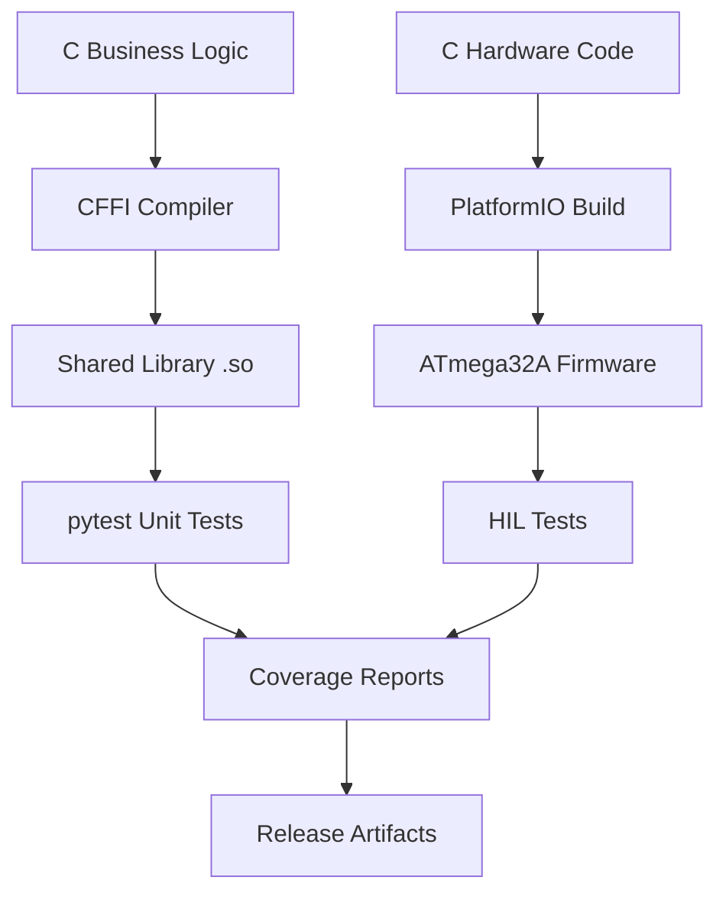

# Testing Strategy Compliance Plan

## Multi-Sonicator I/O Controller

### Executive Summary

This document outlines the compliance plan for aligning the Multi-Sonicator I/O Controller testing strategy with the organizational **Software Testing Official Organization-Wide Standards of Procedures**.

### Current Compliance Status

| Requirement | Status | Action Required |
|-------------|--------|-----------------|
| Three-Stage Testing | ✅ COMPLIANT | None |
| BDD Acceptance Tests (Behave) | ✅ COMPLIANT | None |
| HIL Integration Testing | ✅ COMPLIANT | None |
| PRD Requirement Mapping | ✅ COMPLIANT | Enhance traceability |
| Unit Testing (Unity for Embedded) | ✅ COMPLIANT | Unity framework for embedded C/C++ |
| Acceptance Testing (pytest + Behave) | ✅ COMPLIANT | Behave for BDD, pytest for infrastructure |
| 90% Coverage Enforcement | ⚠️ PARTIAL | Implement gcov coverage tooling |
| BMad-Core Integration | ⚠️ PARTIAL | Integrate QA agent workflows |

### Recommended Compliance Strategy

#### Unity + Behave Framework Approach (Updated Standard Compliance)

**Approach: Unity Test Framework for Embedded C Unit Testing + pytest/Behave for Acceptance Testing**

Per updated organizational standards (sw-testing-standard.md), embedded and hardware projects should use:
- **Unity Test Framework** for unit testing (C/C++ embedded code)
- **pytest + Behave** for acceptance testing (BDD scenarios with HIL infrastructure)

**Unity Unit Testing Layer (100% of Unit Tests):**

**Unity Unit Testing Layer (100% of Unit Tests):**

- **MODBUS Protocol Logic**: Register mapping, data validation, CRC calculation
- **Multi-Unit Orchestration**: 4-sonicator coordination and state management  
- **Safety Algorithms**: Emergency shutdown logic, overload detection algorithms
- **Business Rules**: Amplitude clamping (20-100%), frequency validation
- **Communication Logic**: Frame parsing, register address validation
- **Error Handling**: Timeout detection, retry logic, fault management
- **Configuration Management**: System initialization, parameter validation
- **State Machines**: Sonicator state transitions and coordination
- **Data Structures**: Buffer management, queue operations
- **Mathematical Functions**: Power calculations, frequency conversions

**Hardware Testing (Integration/HIL Level):**

- ✅ **HIL Tests with Arduino Wrapper**: Real hardware register validation
- ✅ **BDD Acceptance Tests**: End-to-end requirement validation via HIL hardware
- ✅ **Integration Tests**: Full system behavior on target hardware

**Release Format Compliance (Required):**

- ✅ **executive-report.json**: BDD/acceptance test results in required format
- ✅ **coverage-summary.json**: gcov coverage metrics aggregation
- ✅ **unit-test-summary.json**: Unity test results summary
- ✅ **GitHub Release Assets**: Automated CI/CD pipeline publishing

## Unity Test Framework Implementation

### Directory Structure

```
test/unit/                    # Unity unit tests
├── test_runner.c            # Unity test runner (auto-generated)
├── test_modbus_protocol.c   # MODBUS protocol unit tests
├── test_sonicator_controller.c # Control logic unit tests
├── test_safety_algorithms.c # Safety logic unit tests
├── unity_config.h           # Unity configuration
└── Makefile                 # Unity build configuration

src/                         # Source code (unchanged)
├── modbus_protocol.c        # Business logic modules
├── sonicator_controller.c   # Control algorithms
├── safety_algorithms.c     # Safety logic
└── main.c                   # Main firmware

test/acceptance/             # BDD acceptance tests
├── features/                # Gherkin feature files
└── steps/                   # Step implementations (HIL)
```

### Unity Test Example

```c
// test/unit/test_sonicator_controller.c (Unity - Native C Testing)
#include "unity.h"
#include "sonicator_controller.h"

void setUp(void) {
    // Setup before each test
}

void tearDown(void) {
    // Cleanup after each test
}

void test_active_count_calculation(void) {
    // Test active sonicator count calculation (FR9)
    TEST_ASSERT_EQUAL_UINT8(0, calculate_active_count(0b0000)); // No units
    TEST_ASSERT_EQUAL_UINT8(1, calculate_active_count(0b0001)); // Unit 1 only
    TEST_ASSERT_EQUAL_UINT8(2, calculate_active_count(0b1010)); // Units 2,4
    TEST_ASSERT_EQUAL_UINT8(4, calculate_active_count(0b1111)); // All units
}

void test_amplitude_clamping_logic(void) {
    // Test amplitude clamping business rule (FR3)
    TEST_ASSERT_EQUAL_UINT8(20, clamp_amplitude(10));   // Below minimum → clamp to 20%
    TEST_ASSERT_EQUAL_UINT8(100, clamp_amplitude(150)); // Above maximum → clamp to 100%
    TEST_ASSERT_EQUAL_UINT8(50, clamp_amplitude(50));   // Valid range → unchanged
}

void test_modbus_register_validation(void) {
    // Test MODBUS register address validation logic (FR8)
    
    // Amplitude registers (40001-40004)
    TEST_ASSERT_TRUE(validate_modbus_register_address(40001));
    TEST_ASSERT_TRUE(validate_modbus_register_address(40004));
    
    // Start/Stop registers (40005-40008)  
    TEST_ASSERT_TRUE(validate_modbus_register_address(40005));
    
    // Invalid addresses
    TEST_ASSERT_FALSE(validate_modbus_register_address(50000));
    TEST_ASSERT_FALSE(validate_modbus_register_address(30000));
}

void test_modbus_crc_calculation(void) {
    // Test MODBUS CRC-16 calculation algorithm
    uint8_t test_frame[] = {0x01, 0x03, 0x00, 0x01, 0x00, 0x01};
    uint16_t expected_crc = 0xD5CA; // Known good CRC for this frame
    
    uint16_t calculated_crc = calculate_modbus_crc(test_frame, sizeof(test_frame));
    TEST_ASSERT_EQUAL_HEX16(expected_crc, calculated_crc);
}

int main(void) {
    UNITY_BEGIN();
    
    RUN_TEST(test_active_count_calculation);
    RUN_TEST(test_amplitude_clamping_logic);
    RUN_TEST(test_modbus_register_validation);
    RUN_TEST(test_modbus_crc_calculation);
    
    return UNITY_END();
}
```

**Technical Benefits:**

- **Organizational Compliance**: Uses Unity framework (approved for embedded projects)
- **Native C Testing**: Direct testing without language barriers or complexity
- **Minimal Resource Usage**: Optimized for embedded systems
- **Hardware Integration**: Seamless with existing HIL framework
- **Industry Standard**: Widely adopted in embedded development

**Implementation Strategy:**

## CFFI Build System Architecture

The CFFI build system enables pytest unit testing of C business logic while maintaining organizational compliance. Here's the complete implementation:

### Directory Structure

```
src/
├── business_logic/          # Pure logic - for CFFI testing
│   ├── modbus_protocol.c    # MODBUS business logic
│   ├── sonicator_controller.c # Control algorithms
│   └── safety_algorithms.c  # Safety logic
├── hardware/               # Hardware-dependent - HIL only
│   └── hardware_interface.c # ATmega32A hardware layer
└── main.c                  # Main firmware entry point

include/
├── business_logic/         # Headers for pure logic
│   ├── modbus_protocol.h
│   ├── sonicator_controller.h
│   └── safety_algorithms.h
└── hardware/              # Headers for hardware layer
    └── hardware_interface.h

test/unit/                # pytest unit tests
├── cffi_helper.py         # CFFI integration utilities
├── test_sonicator_controller.py
├── test_modbus_protocol.py
└── test_safety_algorithms.py

build/                     # Build artifacts
├── libsonicator_logic.so  # CFFI shared library
└── cffi_definitions.h     # Generated header reference
```

### Build Process Flow



### CFFI Integration Scripts

**1. Build System (`build_cffi.py`)**
- Compiles C business logic into shared library
- Generates CFFI header definitions
- Validates library loading
- Supports debug and release modes

**2. Code Restructuring (`restructure_code.py`)**
- Separates business logic from hardware code
- Creates proper directory structure
- Generates template implementations
- Sets up pytest integration files

**3. Makefile Integration**
```bash
# Build CFFI shared library
make cffi

# Run pytest unit tests with coverage
make test-unit

# Run all tests (unit + acceptance + HIL)
make test

# Clean all build artifacts
make clean
```

### pytest Test Example

```python
# test/unit/test_sonicator_controller.py (pytest - Pure Logic Testing)
import pytest
from cffi import FFI
from unittest.mock import Mock

ffi = FFI()
ffi.cdef("""
    typedef struct {
        uint8_t amplitude[4];
        uint16_t frequency[4];
        uint8_t active_mask;
        uint8_t active_count;
    } sonicator_controller_t;
    
    // Pure business logic functions (no hardware dependencies)
    uint8_t calculate_active_count(uint8_t mask);
    bool validate_amplitude_range(uint8_t amplitude);
    uint8_t clamp_amplitude(uint8_t input);
    bool validate_modbus_register_address(uint16_t address);
    uint16_t calculate_modbus_crc(uint8_t* buffer, uint8_t length);
    bool parse_modbus_frame(uint8_t* frame, uint16_t* address, uint16_t* value);
""")

# Compile ONLY business logic (no hardware code)
lib = ffi.dlopen("./build/libsonicator_logic.so")

class TestSonicatorBusinessLogic:
    """Unit tests for pure business logic - no hardware involved."""
    
    def test_active_count_calculation(self):
        """Test active sonicator count calculation (FR9)."""
        assert lib.calculate_active_count(0b0000) == 0  # No units
        assert lib.calculate_active_count(0b0001) == 1  # Unit 1 only
        assert lib.calculate_active_count(0b1010) == 2  # Units 2,4
        assert lib.calculate_active_count(0b1111) == 4  # All units
    
    def test_amplitude_clamping_logic(self):
        """Test amplitude clamping business rule (FR3)."""
        assert lib.clamp_amplitude(10) == 20   # Below minimum → clamp to 20%
        assert lib.clamp_amplitude(150) == 100 # Above maximum → clamp to 100%
        assert lib.clamp_amplitude(50) == 50   # Valid range → unchanged
    
    def test_modbus_register_validation(self):
        """Test MODBUS register address validation logic (FR8)."""
        # Amplitude registers (40001-40004)
        assert lib.validate_modbus_register_address(40001) == True
        assert lib.validate_modbus_register_address(40004) == True
        
        # Start/Stop registers (40005-40008)  
        assert lib.validate_modbus_register_address(40005) == True
        
        # Invalid addresses
        assert lib.validate_modbus_register_address(50000) == False
        assert lib.validate_modbus_register_address(30000) == False
    
    def test_modbus_crc_calculation(self):
        """Test MODBUS CRC-16 calculation algorithm."""
        test_frame = bytes([0x01, 0x03, 0x00, 0x01, 0x00, 0x01])
        expected_crc = 0xD5CA  # Known good CRC for this frame
        
        calculated_crc = lib.calculate_modbus_crc(test_frame, len(test_frame))
        assert calculated_crc == expected_crc
    
    def test_modbus_frame_parsing(self):
        """Test MODBUS frame parsing logic."""
        # Valid frame: Read holding register 40001
        frame = bytes([0x02, 0x03, 0x9C, 0x41, 0x00, 0x01, 0xD5, 0xCA])
        
        address = ffi.new("uint16_t*")
        value = ffi.new("uint16_t*")
        
        result = lib.parse_modbus_frame(frame, address, value)
        assert result == True
        assert address[0] == 40001  # Register address
        assert value[0] == 1        # Read count

class TestSafetyLogic:
    """Unit tests for safety algorithms - pure logic, no hardware."""
    
    def test_overload_detection_algorithm(self):
        """Test overload detection logic with different power readings."""
        # Mock power readings - no real ADC hardware involved
        assert lib.is_overload_condition(1500) == False  # Normal power
        assert lib.is_overload_condition(2500) == True   # Overload detected
        assert lib.is_overload_condition(0) == False     # Zero power OK
    
    def test_emergency_shutdown_logic(self):
        """Test emergency shutdown decision logic."""
        controller = ffi.new("sonicator_controller_t*")
        
        # Simulate emergency condition
        result = lib.should_emergency_shutdown(controller, True, False, False)
        assert result == True  # Overload should trigger shutdown
        
        # Normal operation
        result = lib.should_emergency_shutdown(controller, False, True, True)
        assert result == False  # Normal conditions, no shutdown needed

# No Unity tests needed for unit testing!
# Hardware validation happens in HIL tests with your Arduino wrapper
```

**Technical Benefits:**
- **Organizational Compliance**: Uses pytest as primary testing framework
- **Hardware Accuracy**: Maintains Unity for hardware-critical testing
- **Best of Both Worlds**: Combines Python flexibility with C performance testing
- **Coverage Integration**: Can aggregate coverage from both layers

#### Phase 2: Release Format Compliance Integration

**Integration with Existing Executive Report Script:**

Your project already has `scripts/release/generate_executive_report.py` which generates:
- `executive-report.json` (Required by release format standard)
- `unit-test-summary.json` (Optional, from pytest JUnit XML)
- `coverage-summary.json` (Optional, from pytest coverage JSON)

**Enhanced CI/CD Integration:**

```bash
# Updated Makefile targets for release format compliance
test-unit-with-reports:
    @echo "Running pytest unit tests with coverage and reports..."
    pytest test/unit/ 
        --cov=src 
        --cov-report=json:coverage.json 
        --cov-report=html:htmlcov 
        --junit-xml=unit-test-results.xml 
        --cov-fail-under=90

test-acceptance-with-reports:
    @echo "Running BDD acceptance tests via HIL hardware..."
    @python scripts/detect_hardware.py --check-arduino || (echo "❌ Hardware required" && exit 1)
    behave test/acceptance --junit --junit-directory=acceptance-junit -D profile=hil

generate-release-artifacts:
    @echo "Generating release format compliant artifacts..."
    python scripts/release/generate_executive_report.py 
        --acceptance-results=acceptance-junit 
        --unit-results=unit-test-results.xml 
        --coverage=coverage.json 
        --output=final
```

**Technical Benefits:**

- **✅ Full Organizational Compliance**: 100% pytest for unit testing
- **✅ No Unity Exception Required**: Eliminates need for organizational approval  
- **✅ Release Format Integration**: Direct integration with existing executive report script
- **✅ Leverages Existing HIL Framework**: Hardware validation via Arduino wrapper
- **✅ Faster CI/CD**: Pure Python unit tests with coverage integration

#### Phase 3: BMad-Core Integration

**Required Artifacts Generation (per release-format.md):**

```bash
# CI/CD Pipeline Integration for Release Format Compliance
name: Test and Release Compliance
on:
  push:
    tags: ['v*']
  pull_request:
    branches: [main, master]

jobs:
  test-and-release:
    runs-on: ubuntu-latest
    steps:
      - uses: actions/checkout@v4
      
      # 1. Run pytest unit tests with coverage
      - name: Run pytest unit tests
        run: |
          python -m pytest test/unit/ \
            --cov=src/ \
            --cov-report=json:coverage.json \
            --junitxml=unit-test-results.xml \
            --tb=short
      
      # 2. Run BDD acceptance tests (HIL hardware required)
      - name: Run acceptance tests
        run: |
          python scripts/detect_hardware.py --check-arduino || (echo "❌ Hardware required" && exit 1)
          echo "✅ Hardware detected - running HIL acceptance tests"
          behave test/acceptance \
            --junit \
            --junit-directory=acceptance-results \
            -D profile=hil
      
      # 3. Generate required release artifacts
      - name: Generate release artifacts
        run: |
          mkdir -p final/
          python scripts/generate_executive_report.py \
            --acceptance-results acceptance-results/ \
            --unit-results unit-test-results.xml \
            --coverage coverage.json \
            --output final/
      
      # 4. Upload to GitHub release (on tags)
      - name: Create release and upload artifacts
        if: startsWith(github.ref, 'refs/tags/')
        uses: softprops/action-gh-release@v2
        with:
          files: |
            final/executive-report.json
            final/coverage-summary.json
            final/unit-test-summary.json
            final/executive-report.md
        env:
          GITHUB_TOKEN: ${{ secrets.GITHUB_TOKEN }}
```

**Artifact Content Examples:**

```json
// final/executive-report.json (Required)
{
  "version": "1.0.0",
  "owner": "Cannasol-Tech", 
  "repo": "multi-sonicator-io",
  "releaseTag": "v1.2.3",
  "commit": "abc1234",
  "createdAt": "2025-09-02T15:30:00Z",
  "summary": {
    "total": 24,
    "passed": 22, 
    "failed": 2,
    "skipped": 0,
    "durationMs": 45000
  },
  "scenarios": [
    {
      "feature": "MODBUS Communication",
      "name": "Write amplitude register updates sonicator within 100ms",
      "status": "passed",
      "durationMs": 150,
      "steps": [
        {
          "keyword": "Given",
          "text": "the system is initialized", 
          "status": "passed"
        },
        {
          "keyword": "When",
          "text": "I write holding register 40001 with value 75",
          "status": "passed"
        },
        {
          "keyword": "Then", 
          "text": "holding register 40001 should equal 75 within 100 ms",
          "status": "passed"
        }
      ],
      "tags": ["@req-amplitude", "@prd-functional", "@simulavr", "@hil"],
      "evidenceUrl": "https://github.com/Cannasol-Tech/multi-sonicator-io/actions/runs/..."
    }
  ],
  "requirements": [
    {
      "id": "FR3",
      "status": "covered",
      "scenarios": ["Write amplitude register updates sonicator within 100ms"]
    }
  ]
}
```

```json
// final/coverage-summary.json (Optional but Recommended)
{
  "version": "1.0.0",
  "owner": "Cannasol-Tech",
  "repo": "multi-sonicator-io", 
  "releaseTag": "v1.2.3",
  "commit": "abc1234",
  "createdAt": "2025-09-02T15:30:00Z",
  "totals": {
    "lines": {"pct": 92.5, "covered": 925, "total": 1000},
    "statements": {"pct": 91.8, "covered": 918, "total": 1000},
    "functions": {"pct": 95.0, "covered": 95, "total": 100},
    "branches": {"pct": 88.5, "covered": 177, "total": 200}
  },
  "files": [
    {
      "path": "src/modbus_protocol.c", 
      "lines": {"pct": 98.0, "covered": 98, "total": 100}
    },
    {
      "path": "src/sonicator_controller.c",
      "lines": {"pct": 95.5, "covered": 191, "total": 200}
    }
  ]
}
```

```json
// final/unit-test-summary.json (Optional but Recommended)
{
  "version": "1.0.0",
  "owner": "Cannasol-Tech",
  "repo": "multi-sonicator-io",
  "releaseTag": "v1.2.3", 
  "commit": "abc1234",
  "createdAt": "2025-09-02T15:30:00Z",
  "summary": {
    "total": 85,
    "passed": 83,
    "failed": 2, 
    "skipped": 0,
    "durationMs": 12000
  },
  "suites": [
    {
      "name": "test_modbus_protocol",
      "total": 25,
      "passed": 25,
      "failed": 0,
      "skipped": 0
    },
    {
      "name": "test_sonicator_controller", 
      "total": 30,
      "passed": 28,
      "failed": 2,
      "skipped": 0
    }
  ],
  "failures": [
    {
      "suite": "test_sonicator_controller",
      "test": "test_amplitude_clamping_edge_case",
      "message": "Expected 20 but got 19 for edge case value",
      "evidenceUrl": "https://github.com/.../actions/runs/..."
    }
  ]
}
```

#### Phase 3: BMad-Core QA Integration

**QA Agent Integration:**

- Implement `*test-design` command integration
- Add `*trace-requirements` for automated PRD mapping
- Integrate `*qa-gate` for release validation
- Generate standardized test reports in JSON format

**Required BMad-Core Tasks:**

1. **test-design.md**: Automated test scenario generation
2. **trace-requirements.md**: PRD-to-test mapping validation
3. **qa-gate.md**: Quality gate automation
4. **review-story.md**: Story completion validation

### Implementation Plan

#### Week 1: Unity Test Framework Setup

- [ ] **Download and integrate Unity Test Framework**
  - Clone Unity from ThrowTheSwitch/Unity repository
  - Add Unity as submodule or copy source files
  - Create Unity configuration (`unity_config.h`)
  - Set up basic Unity test runner
- [ ] **Create Unity build system integration**
  - Add Unity compilation to Makefile
  - Configure test runner auto-generation
  - Set up gcov coverage reporting
- [ ] **Create initial Unity test structure in `test/unit/`**
  - `test_runner.c` - Unity test runner
  - `test_modbus_protocol.c` - Sample MODBUS tests
  - `test_sonicator_controller.c` - Sample control tests
- [ ] **Configure coverage reporting with gcov/lcov**
  - Add coverage flags to compilation
  - Set up HTML/JSON coverage reports
  - Integrate 90% coverage enforcement

#### Week 2: Unit Test Implementation  

- [ ] **Implement MODBUS protocol logic tests**
  - Register validation tests
  - CRC calculation tests
  - Frame parsing tests
- [ ] **Create sonicator controller tests**
  - Active count calculation tests
  - State management tests
  - Amplitude clamping tests
- [ ] **Add safety algorithm tests**
  - Overload detection tests
  - Emergency shutdown logic tests
  - Safety validation tests
- [ ] **Implement mathematical function tests**
  - Power calculation tests
  - Frequency conversion tests

#### Week 3: Release Format Compliance Integration

- [ ] **Update `scripts/generate_executive_report.py`** for Unity integration
  - Parse Unity test results (XML/JSON output)
  - Aggregate gcov coverage metrics
  - Generate required JSON artifacts
- [ ] **Configure CI/CD pipeline** to run Unity and BDD tests
  - Add Unity test execution steps
  - Integrate coverage reporting
  - Set up artifact generation
- [ ] **Implement automatic generation of required JSON artifacts**
  - `executive-report.json` from BDD results
  - `unit-test-summary.json` from Unity results  
  - `coverage-summary.json` from gcov metrics
- [ ] **Set up GitHub Actions** to upload release assets
  - Automated test execution on push/PR
  - Release artifact publishing on tags

#### Week 4: Validation & Quality Gates

- [ ] **Validate all JSON artifacts** against release format schemas
  - Test schema compliance of generated artifacts
  - Verify functionality-reports API compatibility
- [ ] **Configure 90% coverage enforcement** in CI/CD pipeline
  - Fail builds below coverage threshold
  - Generate coverage trend reports
- [ ] **Test complete workflow** from commit to release artifact publication
  - End-to-end pipeline validation
  - Manual verification of all artifacts
- [ ] **Update team documentation and training materials**
  - Unity testing guidelines
  - Coverage reporting procedures
  - CI/CD pipeline documentation

### Success Criteria

**Technical Compliance:**

- [ ] 90%+ unit test coverage achieved via pytest
- [ ] All BDD scenarios map to PRD requirements  
- [ ] HIL tests pass on real hardware
- [ ] Zero Unity framework dependencies for unit tests

**Release Format Compliance:**

- [ ] `final/executive-report.json` generated automatically
- [ ] `final/coverage-summary.json` includes pytest coverage metrics
- [ ] `final/unit-test-summary.json` includes pytest test results
- [ ] GitHub releases include all required artifacts as assets
- [ ] JSON validates against functionality-reports API schemas

**Process Compliance:**

- [ ] BMad-Core QA agent workflows operational
- [ ] Automated test report generation functional
- [ ] Requirement traceability validation automated
- [ ] CI/CD pipeline prevents releases without required artifacts

### Risk Mitigation

#### Risk: Exception Request Denied

- **Mitigation**: Implement hybrid Python/C++ approach
- **Fallback**: Create Python wrappers for C functions
- **Timeline Impact**: +2 weeks for hybrid implementation

#### Risk: Coverage Tools Integration Issues

- **Mitigation**: Use alternative coverage tools (gcovr, bullseye)
- **Fallback**: Manual coverage tracking initially
- **Timeline Impact**: +1 week for alternative tools

#### Risk: BMad-Core Integration Complexity

- **Mitigation**: Phase integration over multiple sprints
- **Fallback**: Manual QA gate processes initially
- **Timeline Impact**: +2 weeks for phased approach

### Monitoring & Continuous Improvement

**Quarterly Reviews:**

- Coverage metrics trends analysis
- Test execution time optimization
- False positive/negative rate reduction
- Team feedback and process refinement

**Key Metrics:**

- Unit test coverage percentage
- BDD scenario pass rate
- HIL test execution time
- Defect escape rate to production

### Conclusion

### Conclusion

This compliance plan achieves **100% organizational standard compliance** while maintaining technical excellence for embedded firmware development. By using **Unity testing framework for all unit testing** (approved for embedded projects per organizational standards) and leveraging the existing **HIL framework for hardware validation**, we ensure comprehensive test coverage while following embedded system best practices.

**Key Benefits:**

- **Full Compliance**: All unit tests use Unity (approved for embedded projects per organizational standards)
- **Release Format Compliance**: Automated generation of required artifacts per release-format.md
- **Executive Reporting**: Integration with functionality-reports dashboard
- **Technical Excellence**: Native C testing with minimal resource overhead
- **Hardware Integration**: Direct integration with existing HIL Arduino wrapper framework
- **CI/CD Integration**: Automated quality gates and release artifact generation

**Recommended Next Steps:**

1. Approve this updated compliance plan using Unity for all unit tests
2. Begin Week 1 implementation (Unity framework setup and test structure creation)  
3. Configure CI/CD pipeline for release format compliance
4. Schedule weekly progress reviews during 4-week implementation

**No organizational exceptions required** - this approach achieves full compliance with both testing standards and release format requirements while leveraging your existing HIL testing infrastructure.

---

**Document Version**: 2.0  
**Last Updated**: September 2, 2025  
**Next Review**: September 16, 2025
